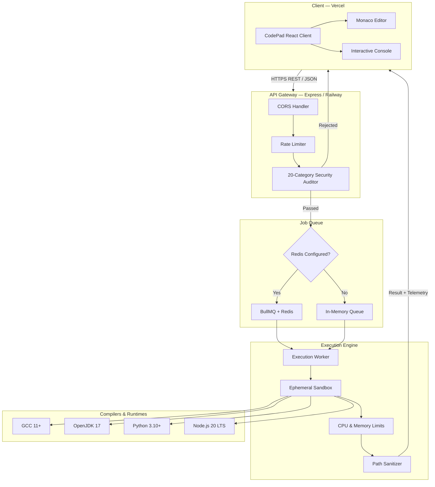
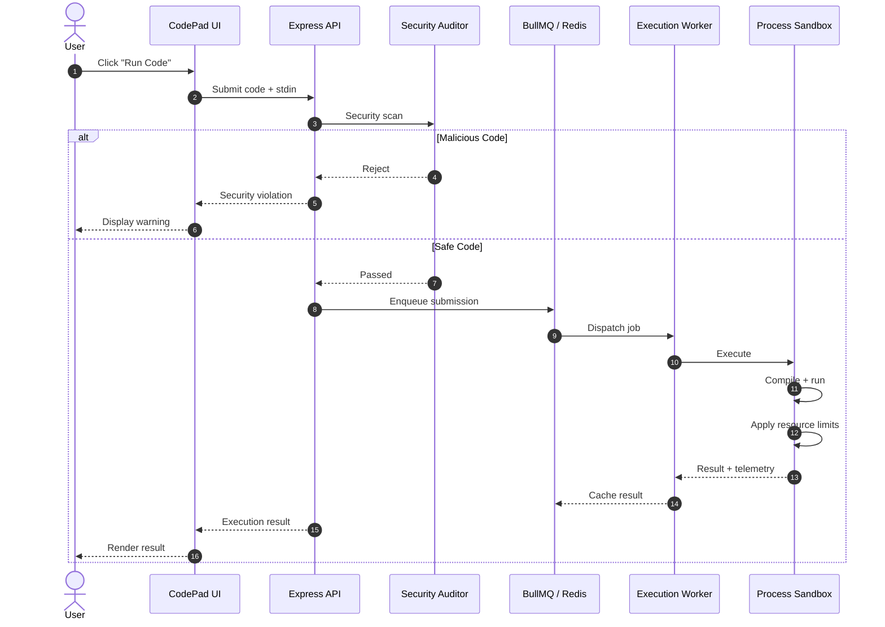

# CodePad [](https://opensource.org/licenses/MIT) [](server/tests) [](https://codepad.abhinandanmishra.in) [](https://codepad-server.abhinandanmishra.in)

**CodePad** is a browser-based multi-language coding IDE for competitive programming and everyday code execution.

Built with Monaco Editor, custom sandboxed code execution, real-time telemetry, competitive-programming templates, and pre-execution security auditing.

### Live

* **Web App:** https://codepad.abhinandanmishra.in
* **Execution API:** https://codepad-server.abhinandanmishra.in
* **API Health:** https://codepad-server.abhinandanmishra.in/health

---

## Architecture

### High-Level System Architecture



### Execution Flow



---

## Features

* **Multi-language IDE** — Write, run, and test C++, Java, Python, JavaScript, TypeScript, and C.
* **Monaco Editor** — Rich code editing with syntax highlighting and language support.
* **Sandboxed Execution** — Isolated execution with CPU, memory, and process limits.
* **Security Auditor** — 20-category pre-execution security analysis.
* **Real-time Telemetry** — Execution status, runtime, and memory usage.
* **Custom Input** — Run code against custom stdin test cases.
* **Competitive Programming I/O** — Fast `Scanner` utilities for JavaScript and TypeScript.
* **Templates** — Built-in competitive-programming templates for common DSA patterns.
* **Slash Commands** — Quickly access templates directly from editor.
* **Auto-save** — Persist code and test cases locally.
* **Custom Snippets** — Create and manage personal templates.
* **Queue System** — BullMQ + Redis in production with in-memory fallback locally.
* **Rate Limiting** — API protection with configurable request limits.
* **Result Caching** — Redis-backed execution result caching.

---

## Supported Languages

| Language   | Runtime                    |
| ---------- | -------------------------- |
| C++        | GCC 11+ / C++17            |
| Java       | OpenJDK 17                 |
| Python     | Python 3.10+               |
| JavaScript | Node.js 20 LTS             |
| TypeScript | TypeScript 5+ / Node.js 20 |
| C          | GCC 11+                    |

---

## Tech Stack

**Frontend**

* React
* Vite
* Tailwind CSS
* Monaco Editor

**Backend**

* Node.js
* Express
* BullMQ
* Redis
* Pino
* Mongodb

**Execution**

* Ubuntu 22.04
* GCC
* OpenJDK
* Python
* Node.js

**Deployment**

* Vercel
* Railway

---

## Quick Start

### Prerequisites

* Node.js `20+`
* npm `9+`
* Optional local compilers/runtimes:

  * `g++` / `gcc`
  * `python3`
  * `javac` / `java`

### Backend

```bash
git clone https://github.com/abhinandanmishra1/Leetcode-Ide.git
cd Leetcode-Ide/server

cp .env.example .env.local
npm install
npm run dev
```

Backend:

```text
http://localhost:5001
```

Redis is optional locally. Without `REDIS_URL`, CodePad uses its in-memory queue.

### Frontend

Open second terminal:

```bash
cd client

cp .env.example .env.local
npm install
npm start
```

Frontend:

```text
http://localhost:3000
```

---

## Testing

Backend:

```bash
cd server
npm test
```

Frontend build:

```bash
cd client
npm run build
```

Current backend suite contains **52 automated tests** covering security, compilers, queues, and API routes.

---

## Production Deployment

### Backend — Railway

Deploy `server/` using Docker.

```env
NODE_ENV=production
PORT=5001
CLIENT_URL=https://codepad.abhinandanmishra.in
RATE_LIMIT_MAX=30
EXECUTION_TIMEOUT_MS=5000
MAX_MEMORY_MB=256
```

Optional:

```env
REDIS_URL=<redis-connection-string>
```

### Frontend — Vercel

Deploy `client/` and configure:

```env
REACT_APP_API_URL=https://codepad-server.abhinandanmishra.in
```

---

## Contributing

Contributions are welcome.

See [CONTRIBUTING.md](CONTRIBUTING.md) for development setup, adding languages, extending security analysis, and pull requests.

---

## License

MIT License.
