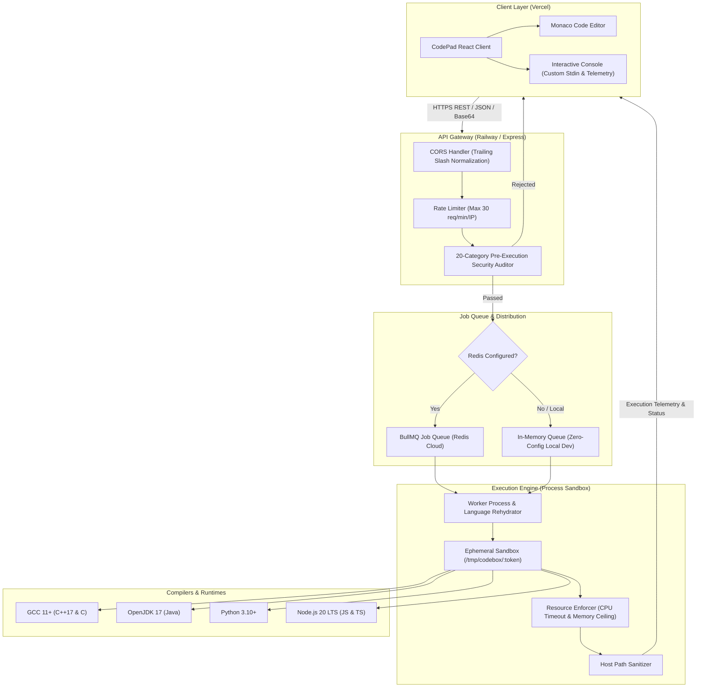
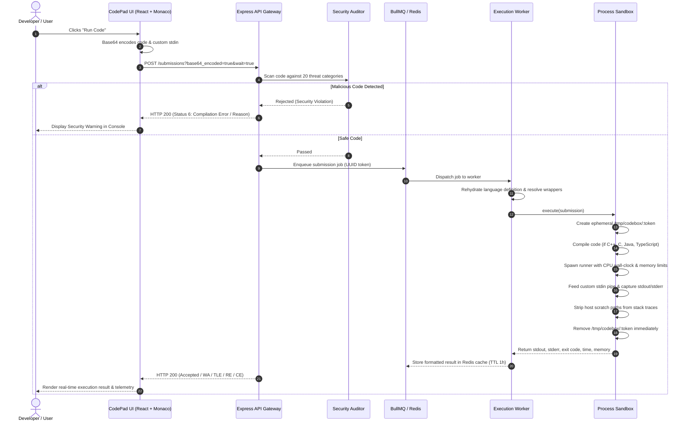

# CodePad [](https://opensource.org/licenses/MIT) [](server/tests) [](https://codepad.abhinandanmishra.in) [](https://codepad-server.abhinandanmishra.in)

A high-performance, sandboxed multi-language online code editor and competitive programming IDE. Built with a custom, in-house execution engine (`server/`), interactive Monaco editor with LeetCode aesthetics, real-time runtime/memory telemetry, zero-copy synchronous input tokenizers, and 20-category pre-execution security auditing.

- 🌐 **Live Web Application**: [https://codepad.abhinandanmishra.in](https://codepad.abhinandanmishra.in)
- ⚡ **Execution API Gateway**: [https://codepad-server.abhinandanmishra.in](https://codepad-server.abhinandanmishra.in)
- 🩺 **API Health Check**: [https://codepad-server.abhinandanmishra.in/health](https://codepad-server.abhinandanmishra.in/health)

---

## Architecture

### High-Level System Architecture



---

### Execution Lifecycle Sequence



---

## Key Highlights & Features

- **100% In-House Sandboxed Execution**: Replaced third-party Judge0 APIs with a dedicated, self-hosted Node.js execution engine (`server/`), eliminating third-party rate limits and API costs.
- **Budget-Optimized for Railway**: Runs efficiently within ~512MB RAM and 0.5 vCPU on an Ubuntu 22.04 LTS container, fully covered by free tier usage credits.
- **20-Category Pre-Execution Security Auditor**:
  - Scans submitted code *before* compilation or process creation.
  - Automatically de-obfuscates Base64 strings, hex/unicode escapes, and string concatenations.
  - Prevents filesystem destruction, command injection, reverse shells, memory exhaustion, container escape, dynamic `eval()`, network socket creation, raw device access, and unauthorized system file access (`/etc/passwd`, etc.).
- **Zero-Copy Synchronous Input Tokenizer (`Scanner`)**:
  - Built-in `Scanner` class for JavaScript and TypeScript (`sc.nextInt()`, `sc.next()`, `sc.nextArray()`, `sc.nextFloat()`, `sc.nextBigInt()`).
  - Strict input validation that throws descriptive Runtime Errors when code expects input that stdin does not provide, or receives invalid token types (e.g. `2h8`).
  - Standard competitive programming syntax preserved for C++ (`cin`), Java (`Scanner`), Python (`sys.stdin`), and C (`scanf`).
- **Monaco Code Editor & LeetCode UI**:
  - Authentic dark theme (`#1a1a1a` background, `#282828` navbar, `#2cbb5d` accents).
  - Multi-tab console with **Testcase (custom stdin)** and **Test Result** panels.
  - Telemetry badges displaying exact **Runtime (ms)** and **Memory (MB)**.
  - LocalStorage auto-save per language with template reset protection.
  - Slash command template library (`/`) and customizable starter templates.
- **Production Resilience**:
  - Ephemeral scratchpad isolation (`/tmp/codebox/:token`) with guaranteed cleanup in `finally` blocks.
  - Path sanitization in stack traces (no internal `/private/var/folders` or `/tmp` leaks).
  - Dynamic CORS handler with automatic trailing slash normalization and multi-origin matching.

---

## Supported Languages & Runtimes

| Language | Language ID | Compiler / Runtime | Flags / Command | Standard Libraries |
| :--- | :---: | :--- | :--- | :--- |
| **C++** | `54` | GCC 11+ (C++17) | `g++ -O2 -std=c++17 -I /app/include` | `<bits/stdc++.h>`, STL |
| **Java** | `62` | OpenJDK 17 | `javac Solution.java` / `java -Xmx256m` | `java.util.*`, `java.io.*` |
| **Python 3** | `71` | Python 3.10+ | `python3 Solution.py` | `sys`, `math`, `collections`, `heapq` |
| **JavaScript** | `63` | Node.js 20 LTS | `node Solution.js` | Built-in `Scanner`, `fs` |
| **TypeScript** | `74` | TypeScript 5+ (Node 20) | `tsc --target es2022 --module commonjs` | Ambient Node.js types, `Scanner` |
| **C** | `50` | GCC 11+ | `gcc -O2 Solution.c -o Solution` | `stdio.h`, `stdlib.h`, `string.h` |

---

## Repository Structure

```
Leetcode-Ide/
├── client/                          # React Frontend (Vite + Tailwind CSS + Monaco)
│   ├── public/                      # Favicons, Web Manifest, App Icons
│   ├── src/
│   │   ├── api/                     # Backend API client (Axios + Fallback URL)
│   │   ├── boilerCodes/             # Official starter templates & CP I/O boilerplates
│   │   ├── components/
│   │   │   ├── Brand/               # CodePad logo & visual identity
│   │   │   ├── CodeEditor/          # Monaco editor integration & autocompletion
│   │   │   ├── Console/             # Stdin testcase & test result telemetry tabs
│   │   │   ├── Navbar/              # Language selector, Run button, Reset button
│   │   │   └── Templates/           # Custom templates & slash snippet modal
│   │   └── utils/                   # LocalStorage persistence & telemetry formatters
│   ├── index.html                   # HTML metadata & brand title
│   ├── vite.config.js               # Vite configuration & env shimming
│   └── package.json
│
├── server/                          # Sandboxed Execution Engine (Node.js 20)
│   ├── src/
│   │   ├── api/                     # Express application, routes, rate limiter, CORS
│   │   ├── executor/                # ProcessSandbox & ResultParser
│   │   ├── languages/               # Language definitions, compilers, & wrappers
│   │   ├── queue/                   # BullMQ Redis producer & worker (in-memory fallback)
│   │   ├── security/                # 20-Category Static Security Auditor
│   │   └── utils/                   # Configuration, Pino logger, Base64 helpers
│   ├── tests/                       # 52 Automated unit & integration tests
│   ├── include/                     # C++ compatibility headers (bits/stdc++.h)
│   ├── Dockerfile                   # Multi-runtime Ubuntu 22.04 container
│   ├── .env.example                 # Server environment variable template
│   └── package.json
│
├── .gitignore                       # Repository ignore rules
├── CONTRIBUTING.md                  # Comprehensive contribution guide
└── README.md                        # Documentation & architecture specs
```

---

## Quick Start (Local Development)

### Prerequisites
- **Node.js**: v20.0.0 or higher
- **npm**: v9.0.0 or higher
- **Compilers (Optional for local testing)**:
  - `g++` / `gcc` (for C/C++)
  - `python3` (for Python)
  - `javac` / `java` (for Java)
  - *Note: If any compiler is missing locally, JavaScript and languages with local runtimes will still execute seamlessly.*

---

### Step 1: Clone the Repository
```bash
git clone https://github.com/abhinandanmishra1/Leetcode-Ide.git
cd Leetcode-Ide
```

---

### Step 2: Start the Backend Execution Engine

```bash
cd server

# Create local environment file
cp .env.example .env.local

# Install dependencies
npm install

# Start in development watch mode
npm run dev
```

The backend server starts on **`http://localhost:5001`**.
> [!NOTE]
> If `REDIS_URL` is empty in `.env.local`, the server automatically falls back to its built-in in-memory queue. No local Redis installation is required!

---

### Step 3: Start the Frontend Client

Open a second terminal window:

```bash
cd client

# Create local environment file
cp .env.example .env.local

# Install dependencies
npm install

# Start Vite development server
npm start
```

The application will open automatically at **`http://localhost:3000`**.

---

### Step 4: Run Automated Tests

To run the complete 52-test automated test suite (security auditor, compilers, queues, and API routes):

```bash
cd server
npm test
```

To verify the frontend production build:
```bash
cd client
npm run build
```

---

## Production Deployment

### 1. Backend Deployment (Railway / Docker)

The backend is packaged as an Ubuntu 22.04 LTS container using [`server/Dockerfile`](file:///Users/abhinandanmishra/personal/Leetcode-Ide/server/Dockerfile).

1. In **[Railway](https://railway.app)**, create a new project from your GitHub repository.
2. Set **Root Directory** to `/server`.
3. Set the following environment variables:
   ```env
   NODE_ENV=production
   PORT=5001
   CLIENT_URL=https://codepad.abhinandanmishra.in
   RATE_LIMIT_MAX=30
   EXECUTION_TIMEOUT_MS=5000
   MAX_MEMORY_MB=256
   ```
   *(Optional: Provide a free [Redis Cloud](https://redis.io/cloud/) connection string for `REDIS_URL` to enable distributed BullMQ queuing).*
4. Link your custom domain (e.g. `codepad-server.abhinandanmishra.in`).

### 2. Frontend Deployment (Vercel)

1. Import the repository into **[Vercel](https://vercel.com)** with the Root Directory set to `client`.
2. Add the environment variable:
   ```env
   REACT_APP_API_URL=https://codepad-server.abhinandanmishra.in
   ```
3. Deploy and connect your custom domain (e.g. `codepad.abhinandanmishra.in`).

---

## Contributing

We welcome contributions! Please see [CONTRIBUTING.md](CONTRIBUTING.md) for detailed guidelines on:
- Setting up your development branch
- Adding a new programming language
- Extending the 20-category security analyzer
- Submitting pull requests

---

## License

This project is open-source and licensed under the [MIT License](LICENSE).
