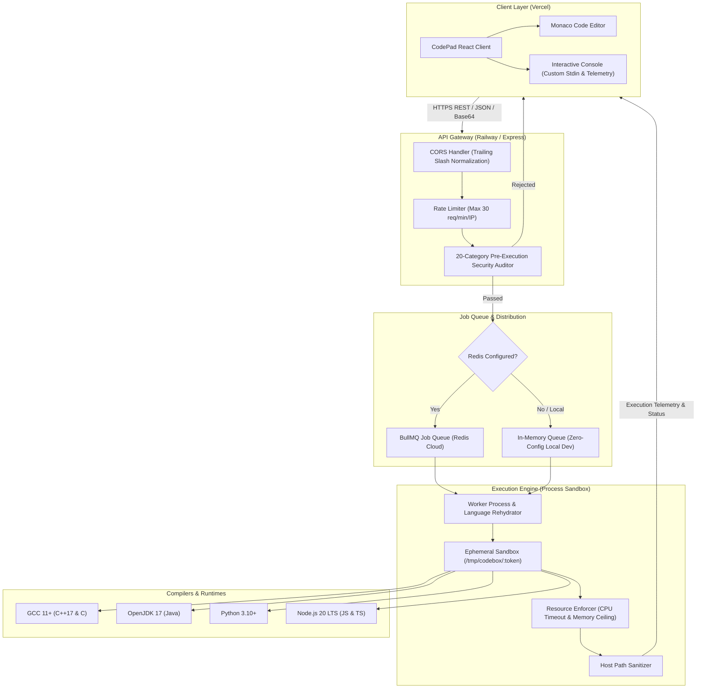
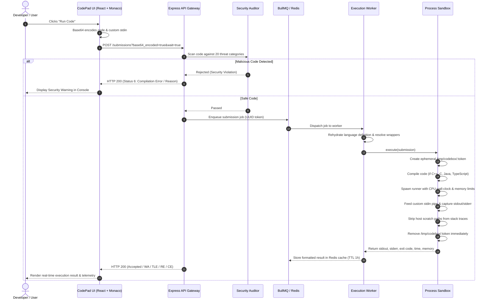

# CodePad [](https://opensource.org/licenses/MIT) [](server/tests) [](https://codepad.abhinandanmishra.in) [](https://codepad-server.abhinandanmishra.in)

A high-performance, sandboxed multi-language online code editor and competitive programming IDE. Built with a custom, in-house execution engine (`server/`), interactive Monaco editor with LeetCode aesthetics, real-time runtime/memory telemetry, zero-copy synchronous input tokenizers, and 20-category pre-execution security auditing.

- 🌐 **Live Web Application**: [https://codepad.abhinandanmishra.in](https://codepad.abhinandanmishra.in)
- ⚡ **Execution API Gateway**: [https://codepad-server.abhinandanmishra.in](https://codepad-server.abhinandanmishra.in)
- 🩺 **API Health Check**: [https://codepad-server.abhinandanmishra.in/health](https://codepad-server.abhinandanmishra.in/health)

---

## Architecture

### High-Level System Architecture



---

### Execution Lifecycle Sequence



---

## Comprehensive Features & Capabilities

### ⚡ 1. In-House Sandboxed Execution Engine
- **Independent Execution Backend**: Fully custom-built Node.js microservice (`server/`) replacing third-party dependencies (Judge0, RapidAPI). Zero API rate limits, zero third-party subscriptions.
- **Ephemeral Scratchpad Isolation**: Each submission is executed inside an isolated, unique temporary directory (`/tmp/codebox/:token`). Ephemeral directories are strictly wiped in `finally` blocks upon completion or failure.
- **Strict Process & Resource Limits**:
  - Wall-clock CPU timeouts (default 5.0 seconds) terminated with `SIGKILL`.
  - Process memory ceilings (256 MB) to prevent out-of-memory crashes.
  - Standard input stream timeouts to prevent hung processes on blocking reads.
- **Host Path Sanitization**: Internal execution paths (e.g. `/private/var/folders/...`, `/tmp/codebox/...`) are automatically stripped from compiler output and runtime stack traces, presenting clean relative diagnostics like `Solution.js:42` or `Solution.cpp:12`.

---

### 🛡️ 2. 20-Category Pre-Execution Security Auditor
Submissions undergo deep static security analysis **prior to process creation or compilation**. The engine prevents sandbox escapes, system tampering, and Denial of Service across **20 threat categories**:

1. **Filesystem Destruction**: Blocks recursive deletes, file truncation, disk overwrites (`rm -rf`, `fs.rmdirSync`, `shutil.rmtree`).
2. **Arbitrary Command Execution**: Detects process spawning (`system()`, `popen()`, `exec*`, `spawn`, `subprocess`, `ProcessBuilder`, `Runtime`).
3. **Shell Interpreters**: Prevents direct invocations of `/bin/sh`, `/bin/bash`, `cmd.exe`, `powershell`.
4. **Command Injection**: Detects dynamic shell chaining, backticks, subshells, and command interpolation.
5. **Filesystem Traversal**: Prevents relative directory escapes (`../`) and unauthorized symlink attacks.
6. **Sensitive File Protection**: Blocks access to `/etc/passwd`, `/etc/shadow`, `/proc/self`, SSH keys, and system hives.
7. **Secret & Credential Exfiltration**: Blocks inspection of system environment variables (`process.env`, `os.environ`, `System.getenv`).
8. **Network Socket & HTTP APIs**: Rejects socket creation, TCP/UDP binds, outbound HTTP clients (`curl`, `fetch`, `urllib`, `requests`).
9. **Reverse Shells**: Detects bash socket redirection, netcat listeners, Python interactive PTY shells.
10. **Privilege Escalation**: Prevents UID/GID manipulation, `sudo`, `doas`, `setuid` invocations.
11. **Container Escape & Namespaces**: Detects namespace tampering (`/proc/1/ns`), cgroup probing, Docker socket access.
12. **Process Inspection & Signaling**: Blocks `ptrace`, process signaling (`SIGKILL`, `kill()`), memory poking.
13. **Resource Exhaustion & Fork Bombs**: Detects fork bombs (`:(){ :|:& };:`), unbounded thread generation, memory bombs.
14. **Dynamic Code Evaluation**: Blocks arbitrary string evaluation (`eval()`, `new Function()`, `compile()`, Python `exec()`).
15. **Obfuscated Payload Execution**: Unrolls Base64 strings, decodes hex/unicode escapes (`\x65\x76\x61\x6c`), and resolves concatenated string tokens before scanning.
16. **Native Code Loading**: Prevents dynamic native binary linking (`dlopen`, `ctypes`, JNI native methods).
17. **Raw Device Access**: Blocks raw disk and memory device access (`/dev/kmem`, `/dev/mem`, `/dev/sda`).
18. **Direct Syscalls & Assembly**: Rejects direct syscall invocations (`syscall()`, `ioctl()`, inline assembly).
19. **Infinite Output Storms**: Detects unbounded, high-frequency print loops that exhaust stream buffers.
20. **Sandbox Boundary Escapes**: Rejects `chroot`, root namespace unsharing, and root filesystem remounts.

---

### 📥 3. High-Performance Synchronous Input Parsing (`Scanner`)
- **Zero-Copy Competitive Programming I/O**: Custom, lightweight pointer-based `Scanner` class tailored for JavaScript and TypeScript:
  - `sc.nextInt()`: Reads and parses signed integers with pointer-level ASCII validation.
  - `sc.next()`: Reads the next whitespace-delimited string token.
  - `sc.nextArray(n)`: Allocates and populates an array of $n$ elements in $O(n)$ time.
  - `sc.nextFloat()`: Parses floating-point numbers with strict `NaN` rejection.
  - `sc.nextBigInt()`: Parses arbitrary-precision integers safely.
  - `sc.hasNext()`: Lookahead boolean check for remaining input tokens.
- **Strict Error Detection**:
  - **Unexpected EOF**: Throws `Runtime Error: Unexpected end of stdin` when code requests more input than testcases provide.
  - **Type Mismatches**: Throws `Runtime Error: Expected integer input on stdin, received "..."` when encountering alphanumeric noise (e.g. `2h8`).
- **Idiomatic Native Inputs**: Standard competitive programming syntax preserved for all other languages (`cin >>` in C++, `Scanner` in Java, `sys.stdin.read().split()` in Python, and `scanf` in C).

---

### 💻 4. Monaco Code Editor & LeetCode Dark UI
- **Authentic LeetCode Aesthetics**: Tailored dark theme canvas (`#1a1a1a`), contrast toolbars (`#282828`), and LeetCode green action buttons (`#2cbb5d`).
- **Rich Code Editor Capabilities**:
  - Monaco-powered intelligent syntax highlighting and bracket pair colorization.
  - Language-specific ambient type definitions (Node.js `@types/node` and standard libraries pre-loaded for lint-free editing).
  - Fixed overflow widgets and smooth scrolling.
- **Interactive Multi-Tab Console**:
  - **Testcase Tab**: Multiline custom stdin input editor for user-defined testcases.
  - **Test Result Tab**: Real-time telemetry badges for execution status (Accepted, Wrong Answer, Time Limit Exceeded, Runtime Error, Compilation Error).
  - High-precision telemetry metrics: exact execution time (in milliseconds) and peak heap memory (in MB).

---

### 💾 5. Persistence, Templates & Slash Commands
- **Per-Language LocalStorage Auto-Save**: Code and custom stdin testcases are automatically persisted to LocalStorage on every keystroke. Refreshing or switching tabs never loses work.
- **Slash Commands (`/`) & Snippet Library**: Type `/` inside the editor or click the template drawer to load pre-built competitive programming templates (Binary Search, BFS/DFS, Disjoint Set Union, Segment Tree, Dijkstra, Dynamic Programming).
- **Template Management**: Create, edit, persist, and overwrite custom user snippets with safe overwrite-confirmation dialogs and quick-reset capabilities.

---

### 🚦 6. Dual-Engine Queue & Resilient Infrastructure
- **Distributed BullMQ with Redis**: Production-grade async job queue with concurrency management, worker isolation, and Redis result caching (1-hour TTL).
- **Zero-Config In-Memory Fallback**: Omitting `REDIS_URL` in local environments automatically activates an in-memory queue—allowing developers to run the entire backend with zero dependencies.
- **Intelligent CORS Engine**: Automatically normalizes origin URLs, strips accidental trailing slashes, and supports multi-origin matching across production and preview deployments.
- **Rate Limiting**: Integrated IP rate limiter (30 requests/minute/IP) with remaining-request headers and countdown warnings.
- **Railway Hobby-Plan Optimization**: Tuned to run comfortably under ~512MB RAM and 0.5 vCPU (~$2.50/month), fully covered by Railway's included credits.

---

## Supported Languages & Runtimes

| Language | Language ID | Compiler / Runtime | Flags / Command | Standard Libraries |
| :--- | :---: | :--- | :--- | :--- |
| **C++** | `54` | GCC 11+ (C++17) | `g++ -O2 -std=c++17 -I /app/include` | `<bits/stdc++.h>`, STL |
| **Java** | `62` | OpenJDK 17 | `javac Solution.java` / `java -Xmx256m` | `java.util.*`, `java.io.*` |
| **Python 3** | `71` | Python 3.10+ | `python3 Solution.py` | `sys`, `math`, `collections`, `heapq` |
| **JavaScript** | `63` | Node.js 20 LTS | `node Solution.js` | Built-in `Scanner`, `fs` |
| **TypeScript** | `74` | TypeScript 5+ (Node 20) | `tsc --target es2022 --module commonjs` | Ambient Node.js types, `Scanner` |
| **C** | `50` | GCC 11+ | `gcc -O2 Solution.c -o Solution` | `stdio.h`, `stdlib.h`, `string.h` |

---

## Repository Structure

```
Leetcode-Ide/
├── client/                          # React Frontend (Vite + Tailwind CSS + Monaco)
│   ├── public/                      # Favicons, Web Manifest, App Icons
│   ├── src/
│   │   ├── api/                     # Backend API client (Axios + Fallback URL)
│   │   ├── boilerCodes/             # Official starter templates & CP I/O boilerplates
│   │   ├── components/
│   │   │   ├── Brand/               # CodePad logo & visual identity
│   │   │   ├── CodeEditor/          # Monaco editor integration & autocompletion
│   │   │   ├── Console/             # Stdin testcase & test result telemetry tabs
│   │   │   ├── Navbar/              # Language selector, Run button, Reset button
│   │   │   └── Templates/           # Custom templates & slash snippet modal
│   │   └── utils/                   # LocalStorage persistence & telemetry formatters
│   ├── index.html                   # HTML metadata & brand title
│   ├── vite.config.js               # Vite configuration & env shimming
│   └── package.json
│
├── server/                          # Sandboxed Execution Engine (Node.js 20)
│   ├── src/
│   │   ├── api/                     # Express application, routes, rate limiter, CORS
│   │   ├── executor/                # ProcessSandbox & ResultParser
│   │   ├── languages/               # Language definitions, compilers, & wrappers
│   │   ├── queue/                   # BullMQ Redis producer & worker (in-memory fallback)
│   │   ├── security/                # 20-Category Static Security Auditor
│   │   └── utils/                   # Configuration, Pino logger, Base64 helpers
│   ├── tests/                       # 52 Automated unit & integration tests
│   ├── include/                     # C++ compatibility headers (bits/stdc++.h)
│   ├── Dockerfile                   # Multi-runtime Ubuntu 22.04 container
│   ├── .env.example                 # Server environment variable template
│   └── package.json
│
├── .gitignore                       # Repository ignore rules
├── CONTRIBUTING.md                  # Comprehensive contribution guide
└── README.md                        # Documentation & architecture specs
```

---

## Quick Start (Local Development)

### Prerequisites
- **Node.js**: v20.0.0 or higher
- **npm**: v9.0.0 or higher
- **Compilers (Optional for local testing)**:
  - `g++` / `gcc` (for C/C++)
  - `python3` (for Python)
  - `javac` / `java` (for Java)
  - *Note: If any compiler is missing locally, JavaScript and languages with local runtimes will still execute seamlessly.*

---

### Step 1: Clone the Repository
```bash
git clone https://github.com/abhinandanmishra1/Leetcode-Ide.git
cd Leetcode-Ide
```

---

### Step 2: Start the Backend Execution Engine

```bash
cd server

# Create local environment file
cp .env.example .env.local

# Install dependencies
npm install

# Start in development watch mode
npm run dev
```

The backend server starts on **`http://localhost:5001`**.
> [!NOTE]
> If `REDIS_URL` is empty in `.env.local`, the server automatically falls back to its built-in in-memory queue. No local Redis installation is required!

---

### Step 3: Start the Frontend Client

Open a second terminal window:

```bash
cd client

# Create local environment file
cp .env.example .env.local

# Install dependencies
npm install

# Start Vite development server
npm start
```

The application will open automatically at **`http://localhost:3000`**.

---

### Step 4: Run Automated Tests

To run the complete 52-test automated test suite (security auditor, compilers, queues, and API routes):

```bash
cd server
npm test
```

To verify the frontend production build:
```bash
cd client
npm run build
```

---

## Production Deployment

### 1. Backend Deployment (Railway / Docker)

The backend is packaged as an Ubuntu 22.04 LTS container using [`server/Dockerfile`](file:///Users/abhinandanmishra/personal/Leetcode-Ide/server/Dockerfile).

1. In **[Railway](https://railway.app)**, create a new project from your GitHub repository.
2. Set **Root Directory** to `/server`.
3. Set the following environment variables:
   ```env
   NODE_ENV=production
   PORT=5001
   CLIENT_URL=https://codepad.abhinandanmishra.in
   RATE_LIMIT_MAX=30
   EXECUTION_TIMEOUT_MS=5000
   MAX_MEMORY_MB=256
   ```
   *(Optional: Provide a free [Redis Cloud](https://redis.io/cloud/) connection string for `REDIS_URL` to enable distributed BullMQ queuing).*
4. Link your custom domain (e.g. `codepad-server.abhinandanmishra.in`).

### 2. Frontend Deployment (Vercel)

1. Import the repository into **[Vercel](https://vercel.com)** with the Root Directory set to `client`.
2. Add the environment variable:
   ```env
   REACT_APP_API_URL=https://codepad-server.abhinandanmishra.in
   ```
3. Deploy and connect your custom domain (e.g. `codepad.abhinandanmishra.in`).

---

## Contributing

We welcome contributions! Please see [CONTRIBUTING.md](CONTRIBUTING.md) for detailed guidelines on:
- Setting up your development branch
- Adding a new programming language
- Extending the 20-category security analyzer
- Submitting pull requests

---

## License

This project is open-source and licensed under the [MIT License](LICENSE).
