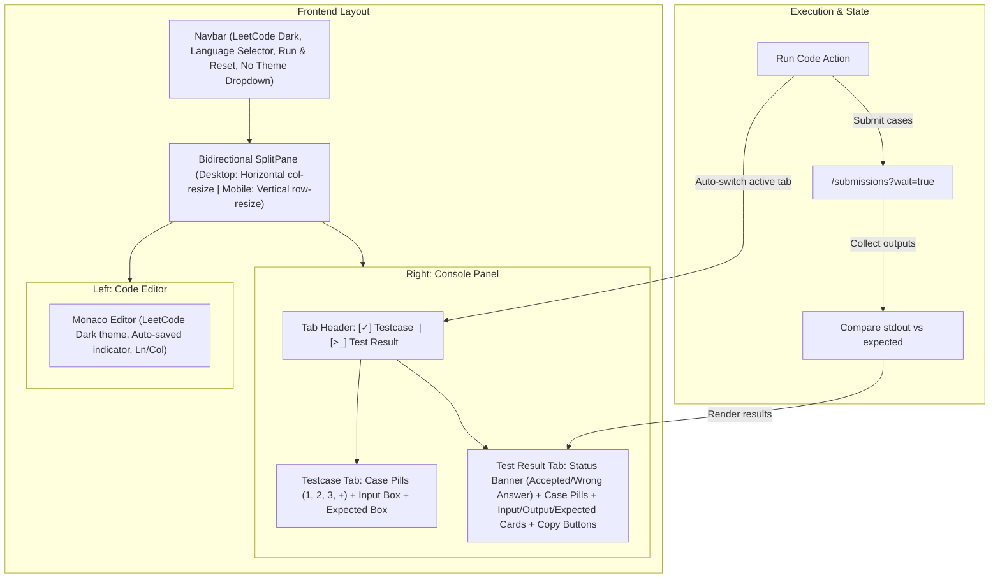

# LeetCode UI Overhaul & Multi-Testcase Engine Implementation Plan

> **For agentic workers:** REQUIRED SUB-SKILL: Use superpowers:subagent-driven-development (recommended) or superpowers:executing-plans to implement this plan task-by-task. Steps use checkbox (`- [ ]`) syntax for tracking.

**Goal:** Transform the IDE into an authentic LeetCode workspace with a single LeetCode Dark theme, a bidirectional resizable split pane, multiple testcase tabs with input/expected-output comparison, auto-switching to the test result tab upon execution, and one-click copy buttons for outputs and errors.

**Architecture:** 
- A zero-dependency bidirectional `SplitPane` with mouse/touch drag listeners, min/max dimension clamping, and `localStorage` layout persistence.
- A multi-case test manager in `ConsolePanel` maintaining an array of testcases (`{ id, name, input, expected }`) persisted per language in `localStorage`.
- A concurrent execution orchestrator in `App.jsx` running all testcases against the backend engine, auto-switching to the `Test Result` tab, and calculating per-case and aggregate statuses (`Accepted`, `Wrong Answer`, `Runtime Error`, `Compile Error`, `Time Limit Exceeded`).
- A simplified LeetCode Dark UI removing the `ThemeDropdown` and standardizing Monaco and Tailwind onto `#1a1a1a` / `#262626` / `#333333` with green `#2cbb5d` and red `#ef4743` indicators.

**Tech Stack:** React 18, Vite 5, Tailwind CSS, Monaco Editor (`@monaco-editor/react`), FontAwesome icons, Node 20 LTS.

---

## Global Constraints
- Maximum Railway budget remains strict ($10/month maximum, aiming for $2.55–$3.50/mo).
- Single theme: Authentic LeetCode Dark everywhere (`#1a1a1a` canvas, `#262626` panels, `#333333` borders). Remove theme dropdown.
- Mobile responsiveness: Horizontal split (`col-resize`) for desktop ($\ge 768\text{px}$), vertical split (`row-resize`) for smaller screens ($< 768\text{px}$) with strict min-width and min-height constraints.
- Testcases persistence: Stored in `localStorage` per language key so user test cases survive browser reload.
- Full compatibility with existing in-house sandboxed execution engine and `<bits/stdc++.h>`.

---

## User Review Required

> [!IMPORTANT]
> 1. **Multi-Case Execution Strategy**: When clicking "Run Code", the client will execute all configured testcases against the backend concurrently via `POST /submissions?wait=true` (or rapid sequence if preferred). Since our local sandbox takes ~30–60ms per run, running 3 testcases completes in <150ms.
> 2. **Evaluation Logic**:
>    - If `Expected Output` is provided: Case passes if and only if `trimmed(stdout) === trimmed(expected)`. If mismatched, status is marked **Wrong Answer**.
>    - If `Expected Output` is left blank: Case passes if program exits with code 0 (Status: `Accepted`).
>    - Aggregate status: If any case fails with compile/runtime/TLE or wrong answer, overall banner displays the first failing status. If all pass, overall status is **Accepted**.

---

## Proposed Changes



---

### Task 1: Resizable Bidirectional SplitPane Component

**Files:**
- Create: `client/src/components/SplitPane/SplitPane.jsx`

**Interfaces:**
- Consumes: `children: [LeftOrTop, RightOrBottom]`, `minLeft: 320`, `minRight: 280`, `minTop: 200`, `minBottom: 180`.
- Produces: Resizable split container with responsive orientation (`horizontal` on $\ge 768\text{px}$, `vertical` on $< 768\text{px}$), draggable divider handle with hover feedback, and `localStorage` layout persistence.

---

### Task 2: Multi-Testcase Storage & Helper Models

**Files:**
- Modify: `client/src/utils/storage.js`

**Interfaces:**
- Consumes: `languageId: number`
- Produces: `getSavedTestCases(languageId): TestCase[]`, `saveTestCases(languageId, cases: TestCase[])`, backwards-compatibility migration from legacy single stdin.

---

### Task 3: Copy Button Component & Test Result Panel Overhaul

**Files:**
- Create: `client/src/components/Console/CopyButton.jsx`
- Create: `client/src/components/Console/TestcaseTab.jsx`
- Create: `client/src/components/Console/TestResultTab.jsx`
- Modify: `client/src/components/Console/ConsolePanel.jsx`

**Interfaces:**
- Consumes: `testCases`, `setTestCases`, `activeCaseId`, `results`, `isRunning`, `overallStatus`, `activeTab`, `setActiveTab`.
- Produces: Tabbed interface matching LeetCode screenshot:
  - Header: `[✓] Testcase | [>_] Test Result`
  - Testcase Tab: Case pills (`Case 1`, `Case 2`, `+`, `✕`), Input textarea card, Expected Output textarea card.
  - Test Result Tab: Big LeetCode status banner (`Accepted` in `#2cbb5d`, `Wrong Answer` in `#ef4743`), Runtime ms, Memory MB, Case pills with `faCheck` (green) or `faTimes` (red), Input box with copy button, Output box with copy button, Expected box with copy button, Error box with copy button.

---

### Task 4: Unified LeetCode Dark Theme & Navbar Simplification

**Files:**
- Modify: `client/src/components/Navbar/Navbar.jsx`
- Modify: `client/src/components/CodeEditor/CodeEditor.jsx`
- Remove: `ThemeDropdown` from Navbar

**Interfaces:**
- Navbar retains: LeetCode brand logo, Language Selector dropdown, Reset to Boilerplate, Run Code button with spinner.
- Theme is locked to LeetCode Dark (`#1e1e1e` Monaco background, `#1a1a1a` app canvas).

---

### Task 5: App Integration & Multi-Case Execution Orchestration

**Files:**
- Modify: `client/src/App.jsx`

**Interfaces:**
- Coordinates `SplitPane`, `Navbar`, `CodeEditor`, and `ConsolePanel`.
- On "Run Code":
  1. Calls `setActiveTab("result")` immediately.
  2. Sets `isRunning = true`.
  3. Maps over `testCases` and calls `submitCode({ language_id, source_code, stdin })` with `wait=true`.
  4. Collects and parses outputs, compares against `expected` output.
  5. Computes overall status (`Accepted`, `Wrong Answer`, `Runtime Error`, `Compile Error`).
  6. Switches `activeCaseId` to first failing case (if any) or preserves current.
  7. Sets `isRunning = false`.

---

## Verification Plan

### Automated Tests
1. **Server Tests**:
   ```bash
   npm test --prefix server
   ```
   Must pass all 19 tests.
2. **Client Production Build**:
   ```bash
   npm run build --prefix client
   ```
   Must compile cleanly without errors in < 2 seconds.

### Manual Verification
1. **Test Result Auto-Switch**:
   - In `Testcase` tab, enter input, click **Run Code**.
   - Verify active tab immediately switches to `Test Result`.
2. **Bidirectional Resizing**:
   - On desktop: drag divider left and right. Verify minimum width constraints are respected.
   - Resize window to mobile width (<768px): verify divider switches to horizontal row-resize and allows dragging up/down with min-height constraints.
   - Refresh page: verify split ratio persists.
3. **Multi-Testcase Execution & Comparison**:
   - Test Case 1 matching expected -> `[✓] Case 1`.
   - Test Case 2 differing from expected -> `[✕] Case 2` with `Wrong Answer` banner.
4. **Copy Buttons**:
   - Verify copy buttons copy exact text to clipboard with "Copied!" feedback.
5. **Theme**:
   - Pure LeetCode Dark theme without dynamic theme dropdown.
