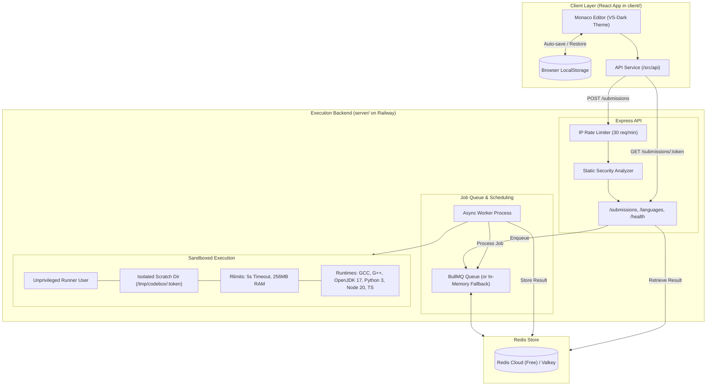

# Design Document: Sandboxed Code Execution Service & LeetCode UI Overhaul

- **Date**: 2026-09-13
- **Status**: Approved
- **Target Repository**: `Leetcode-Ide`

---

## 1. Executive Summary
The goal of this milestone is to replace the third-party Judge0 RapidAPI dependency in `Leetcode-Ide` with a self-hosted, high-performance, sandboxed code execution backend (`server/`), modernizing the frontend client (`client/`) to a LeetCode dark aesthetic, and introducing local persistence so users never lose their code.

The backend is engineered for direct deployment on the Railway platform within a **$10/month hard budget constraint** (designed to run within Railway's $5 included usage using ~512MB RAM), utilizing free Redis Cloud for job queuing, unprivileged process sandboxing with system resource limits (`rlimits`), pre-execution security analysis, and IP-based rate limiting.

---

## 2. Architectural Decisions & Key Constraints

1. **Unified Container Deployment**:
   - Instead of maintaining 3 separate continuous containers (API, Worker, Redis) which would consume 1.2GB–1.5GB RAM and cost ~$8–$11/month, we combine the Express API and the execution worker into a single container image.
   - **Cost Target**: ~512MB RAM @ $0.000231/GB-hour = ~$2.55/month on Railway. This stays completely within Railway's $5 included monthly credit on the Hobby plan ($0 out-of-pocket).
2. **Zero-Cost Redis**:
   - Supports **Redis Cloud** (free 30MB forever tier) or Railway Valkey/Redis via a single `REDIS_URL`.
   - Features an automatic in-memory queue fallback when `REDIS_URL` is omitted, allowing zero-setup local development on macOS.
3. **Core LeetCode Language Stack (6 Languages)**:
   - C++ (GCC 11+, `-O2 -std=c++17`)
   - Java (OpenJDK 17, `-Xmx256m`)
   - Python 3 (Python 3.10+)
   - JavaScript (Node.js 20 LTS)
   - TypeScript (TypeScript 5+ compiled with `tsc`)
   - C (GCC 11+, `-O2`)
4. **Sandboxed Execution & Security Defense-in-Depth**:
   - **Static Analysis**: Pre-execution regex inspection (`codeAnalyzer.js`) immediately rejects attempts at fork bombs, network socket syscalls, `ptrace` process manipulation, and filesystem snooping (`/etc/passwd`, `/proc/self/`, `/var/run/docker.sock`).
   - **Process Sandboxing (`ProcessSandbox.js`)**: Execution runs as an unprivileged `runner` user inside an ephemeral directory (`/tmp/codebox/<token>`), wiped immediately upon termination. Processes are bounded by strict wall-clock time limits (default 5 seconds), output buffers (10MB), and memory ceilings (256MB).
   - **Local macOS Fallback**: Built-in environment detection provides frictionless local development on macOS without requiring Linux-specific cgroups.
5. **Judge0 Compatibility**:
   - Endpoints implement the Judge0 contract (`POST /submissions`, `GET /submissions/:token`, supporting base64 encoding and `?wait=true`), ensuring straightforward integration and future extensibility.
6. **Rate Limiting**:
   - Protects against denial-of-service and bot spam with `express-rate-limit` capped at 30 requests per minute per IP.
7. **Client Persistence & UI Upgrade**:
   - `localStorage` auto-saves code per language so users never lose their work across reloads or language switches.
   - LeetCode dark design system (`#1a1a1a` background, `#262626` panels, `#2cbb5d` accents).
   - Tabbed interactive console separating custom `stdin` testcases from runtime outputs and telemetry (execution duration and memory usage).

---

## 3. Detailed System Architecture



---

## 4. Component Specifications

### 4.1 Backend (`server/`)

#### Directory Layout
```
server/
├── Dockerfile
├── package.json
├── src/
│   ├── index.js                     # Bootstrap entry point
│   ├── api/
│   │   ├── server.js                # Express app configuration
│   │   ├── routes/
│   │   │   ├── submissions.js       # POST /submissions, GET /submissions/:token
│   │   │   ├── languages.js         # GET /languages
│   │   │   └── health.js            # GET /health
│   │   └── middleware/
│   │       ├── rateLimiter.js       # express-rate-limit configuration
│   │       ├── errorHandler.js      # Global error and 404 handler
│   │       └── validation.js        # Request payload validation
│   ├── executor/
│   │   ├── ProcessSandbox.js        # Process spawning, timeout, rlimit, cleanup
│   │   ├── ResultParser.js          # Status mapping (Accepted, TLE, Error)
│   │   └── ExecutorFactory.js       # Selects production sandbox vs local development runner
│   ├── languages/
│   │   ├── index.js                 # Language registry & Judge0 ID mappings
│   │   ├── cpp.js                   # C++ compiler and execution config (id: 54)
│   │   ├── c.js                     # C config (id: 50)
│   │   ├── java.js                  # Java config (id: 62)
│   │   ├── python.js                # Python 3 config (id: 71)
│   │   ├── javascript.js            # JavaScript config (id: 63)
│   │   └── typescript.js            # TypeScript config (id: 74)
│   ├── queue/
│   │   ├── producer.js              # Enqueue submission jobs
│   │   ├── worker.js                # Dequeue and execute jobs
│   │   └── inMemoryQueue.js         # Fallback queue when Redis is not present
│   ├── security/
│   │   └── codeAnalyzer.js          # Static pattern rejection
│   └── utils/
│       ├── base64.js                # Safe encode/decode helpers
│       ├── config.js                # Environment configuration
│       └── logger.js                # Structured Pino logger
└── tests/
    ├── api.test.js                  # Integration tests for endpoints
    ├── executor.test.js             # Multi-language execution test suite
    └── security.test.js             # Security static analyzer test suite
```

#### API Specifications
1. **`POST /submissions`**
   - **Query Parameters**:
     - `base64_encoded`: `true` | `false` (default: `true`)
     - `wait`: `true` | `false` (default: `false`)
   - **Request Body**:
     ```json
     {
       "language_id": 54,
       "source_code": "I2luY2x1ZGU8aW9zdHJlYW0+...",
       "stdin": "..."
     }
     ```
   - **Response (`wait=false`)**: HTTP `201 Created`
     ```json
     { "token": "c7f993bb-0f9c-485a-8b89-216e91f1ad63" }
     ```
   - **Response (`wait=true`)**: HTTP `200 OK` (full submission object).

2. **`GET /submissions/:token`**
   - **Query Parameters**: `base64_encoded=true`
   - **Response**: HTTP `200 OK`
     ```json
     {
       "token": "c7f993bb-0f9c-485a-8b89-216e91f1ad63",
       "status": {
         "id": 3,
         "description": "Accepted"
       },
       "stdout": "SGVsbG8gV29ybGQhCg==",
       "stderr": null,
       "compile_output": null,
       "time": 0.032,
       "memory": 14200,
       "exit_code": 0
     }
     ```

3. **Status Codes (Judge0 Compatible)**:
   - `1`: In Queue
   - `2`: Processing
   - `3`: Accepted
   - `5`: Time Limit Exceeded
   - `6`: Compilation Error
   - `11`: Runtime Error (NZEC / Exception)
   - `13`: Internal Error

---

### 4.2 Frontend (`client/`)

#### Updated Component Hierarchy
```
client/src/
├── api/
│   └── index.js                     # Updated to query backend API
├── components/
│   ├── Navbar/
│   │   ├── Navbar.js                # LeetCode branded navbar with run button
│   │   └── RunButton.js             # Run button with animated loading spinner
│   ├── CodeEditor/
│   │   └── CodeEditor.js            # Monaco editor with theme & autosave integration
│   ├── Console/
│   │   ├── ConsoleTabs.js           # Tabs switcher: [Testcase] [Test Result]
│   │   ├── TestcaseInput.js         # Custom stdin input area
│   │   └── TestResult.js            # Status badge, metrics, stdout/stderr display
│   └── Dropdowns/
│       ├── LanguageDropdown.js      # Cleaned up to 6 core languages
│       └── ThemeDropdown.js         # Theme selector
├── constants/
│   └── languages.js                 # 6 Core supported languages
├── boilerCodes/
│   └── index.js                     # Tested starter templates for all 6 languages
└── utils/
    ├── storage.js                   # LocalStorage persistence manager
    └── formatters.js                # Output, runtime, and memory formatters
```

#### LocalStorage Persistence Rules
* **Keys**:
  - `leetcode_ide_code_${languageId}`: Code string for that language.
  - `leetcode_ide_stdin_${languageId}`: Custom input for that language.
  - `leetcode_ide_lang`: ID of the active language.
  - `leetcode_ide_theme`: Active Monaco theme.
* **Behaviors**:
  - Debounced auto-save (300ms) on editor keystroke.
  - On language change, retrieves cached code. If empty, populates from `boilerCodes[languageId]`.
  - "Reset to default" button displays a modal/tooltip to confirm reverting to original boilerplate.

---

## 5. Security & Threat Modeling

| Threat | Mitigation Mechanism |
| :--- | :--- |
| **Fork Bomb / CPU Exhaustion** | Static regex scanner catches `fork()` loops; OS `nproc` capped; hard 5.0s execution timeout kills process tree. |
| **Network Escape** | Regex blocks `socket()`, `connect()`, `ServerSocket`; unprivileged container has restricted local loopback. |
| **Filesystem Snooping** | Non-root `runner` user; execution in isolated `/tmp/codebox/:token` scratch directory; sensitive system paths blocked by static analyzer. |
| **Memory Exhaustion (OOM)** | Process memory bounded to 256MB (`-Xmx256m` for Java, Node heap flags for JS/TS, `maxBuffer: 10MB`); container memory limit set to 512MB on Railway. |
| **API Denial-of-Service** | `express-rate-limit` caps client to 30 submissions per minute per IP; frontend disables Run button while a request is in flight. |

---

## 6. Railway Deployment & Operations

### 6.1 Container Image Specification (`server/Dockerfile`)
* **Base OS**: Ubuntu 22.04 LTS
* **Installed Packages**: `gcc`, `g++`, `openjdk-17-jdk-headless`, `python3`, `curl`, `ca-certificates`, `time`, `nodejs 20.x`, `typescript`
* **User**: `runner` (UID: 1001, GID: 1001) with ownership restricted to `/tmp/codebox` and `/app`
* **Exposed Port**: 5001

### 6.2 Railway Resource & Cost Modeling
* **Memory Allocation**: 512MB RAM
* **vCPU Allocation**: 0.5 vCPU
* **Estimated Cost**:
  - 512MB RAM @ $0.000231/GB-hour × 730 hours ≈ $0.084/day ≈ **$2.55/month**.
  - CPU usage: ~$0.50 – $1.00/month during active compilation bursts.
  - Total Monthly Cost: **~$3.00 – $3.55/month** (completely covered by Railway's $5 included credit).
* **Hard Budget Cap**: Configure Railway Project Settings → Usage Limit = `$10.00`.

### 6.3 Environment Variables
* `PORT`: `5001` (provided by Railway)
* `NODE_ENV`: `production`
* `REDIS_URL`: `redis://default:<password>@<redis-cloud-host>:<port>`
* `RATE_LIMIT_MAX`: `30`
* `CLIENT_URL`: `https://leetcode-ide.vercel.app`

---

## 7. Verification & Acceptance Criteria

1. **Automated Backend Tests**:
   - `npm test` inside `server/` must pass 100% across all 6 languages.
   - Tests verify successful execution, exit codes, stdin passing, compilation error formatting, runtime error detection, timeout enforcement, and security pattern rejections.
2. **Frontend Integration Tests**:
   - Run code in C++, Java, Python 3, JavaScript, TypeScript, and C, verifying that output displays properly in the Test Result tab.
   - Verify that custom testcase stdin is forwarded and processed accurately.
   - Verify that closing and reopening the browser preserves the user's code for each language.
   - Verify that clicking "Reset to default" restores the initial starter template.
   - Verify that submitting more than 30 requests triggers the 429 rate limit message without crashing the UI.
3. **Railway Deployment Verification**:
   - Railway deployment builds and boots successfully with `/health` returning HTTP 200 `{ status: "ok", queue: "ready" }`.
